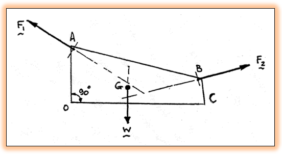

# **VIRTUAL LAB :**    1st year Mechanics - the 3-Force Body Case Study

	
  
# DEMO description

In this **VIRTUAL LAB** we explore a quadrilateral steel plate acted on by two string tensions **F1**, **F2**, and its weight **W**.  The points of application of these three forces are at the centres of the holes A and B and at the body’s centre of mass G, as shown in the Figure below. The system is planar, that is all forces lie in one plane.

}

The objective of this experiment is to:

   -  Show that when a body is in equilibrium the **vector sum of the forces must always add to zero**; 
   -  Establish a relationship between the lines of actions of the forces acting on a 3-force body. 

  
# Owner

`Bradley Horton (bhorton@mathworks.com)`

  
# Concepts

Some key concepts that are demonstrated include:

  
# Suggested Audience

CSEs, 1st year undergraduate students, professors, engineering

  
# Workflow

Open and read the file` **TASK_00_START_HERE_PLEASE.mlx** this gives an overview of the Lab.   

	
  

There are 3 tasks that need to be completed in this Lab.  Each task has it's dedicated script file(see above)

   1.  **TASK_01** :   We'll define numeric values for our experimental setup system (e.g.:  the mass of the steel plate, the spring stiffness, etc) 
   1.  **TASK_02** :   We'll open and run a simulation of our experimental setup - we'll actually LOG time series data from the simulation. 
   1.  **TASK_03** :   We'll analyse the logged simulation data and use it to confirm the Force equillibrium of the plate 

  
  
# Release that demo was last tested in

These demos have been tested in the R2023a MATLAB releases.

  
# System Requirements

The Demo has the following product dependencies:

   1.  MATLAB 
   1.  Simulink 
   1.  Simscape 
   1.  Simscape Multibody 

  
# Revision History

First draft 05-Jul-2023

